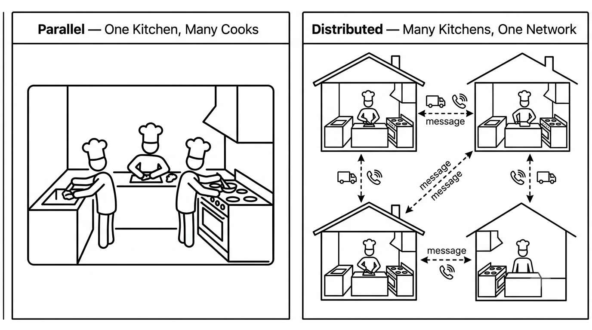

# Session 1 · Mon Aug 31 {.section}
## Course Intro & Why This Matters

::: {.notes}
**Full-session timing plan (50 min total) — one line per upcoming slide, use this as your pacing checkpoint:**

| Slide | Time |
|---|---|
| Before We Start | 4 min |
| The Ask | 4 min |
| Why This Should Sound Like Nonsense | 4 min |
| Why Can't We Just Use Excel? | 4 min |
| Why Now? Clock Speeds & the Multicore Turn | 5 min |
| Netflix | 4 min |
| Google | 4 min |
| Amazon | 5 min |
| The Pipeline | 5 min |
| Roadmap Table | 4 min |
| Parallel vs. Distributed | 4 min |
| Keep This Picture | 3 min |

Each slide below is written to stand on its own as a study page — students have no textbook for this course, the slides are it. If you're running behind, skip the Google *or* Amazon vignette rather than rushing through either one incompletely.
:::

---

## Before We Start

- **COSC420: Distributed/Parallel Computing** — Mon/Wed/Fri, 50 min each. **Monday = Lecture A, Wednesday = Lecture B, Friday = Lab.**
- Grading has seven components: Checkpoints, Labs, Quizzes, Midterm, Final, Capstone, Engaged Learning — see the syllabus for exact weights.
- **What this course assumes you know:** computer organization — memory, registers, the CPU. **What it does not assume:** any operating systems or networking course. Every explanation this semester is built from computer-organization concepts up, never from OS/networking vocabulary down.
- **The promise:** by the last week of the semester, you and a partner will build and demo a real distributed data pipeline — files stored across machines, code that runs on a cluster, a live dashboard backed by a database. Today, every one of those phrases should sound unfamiliar. That's the correct starting point.

::: {.notes}
**Timing: 4 min.** Don't read the syllabus line by line — point at it, move on fast. The one sentence worth pausing on is "what this course does not assume" — say it out loud, it visibly lowers anxiety in the room before the cold open.
:::

---

# Day One {.section}
## Your First Week at StreamBase

::: {.callout-important}
Imagine you just started a data engineering internship at **StreamBase**, a fast-growing streaming startup.
:::

Your manager pulls you aside Monday morning:

> *"StreamBase has 200 million subscribers. Every stream, pause, skip, and rating gets logged — we're sitting on 80 billion events in our data lake. The content licensing team meets in December and they need to know: **which genres and films should we prioritize next quarter?** That question requires distributed processing — one machine can't touch 80 billion rows. We use HDFS and Spark for exactly this. Your job: build and validate the pipeline on a 100K-row sample first. If the aggregations are right and the dashboard answers the question, we scale it up. The code doesn't change. Only the data does. Demo is December 11."*

You'd probably say: *"Sure — what's HDFS? What's Spark?"*

::: {.notes}
**Timing: 4 min.** Pause after the quote. Let it land. Ask: "How many of you know what HDFS is? Spark? MongoDB? A REST API?" Nobody should raise their hand.
:::

---

## Why This Should Sound Like Nonsense

That's the correct reaction — and the whole point of this course.

- **HDFS**, **Spark**, and **MongoDB** are all tools for working with data that doesn't fit on one machine. You'll meet each one by name later this semester: HDFS in Module 3, Spark in Module 4, MongoDB in Module 5.
- The manager's ask sounds intimidating because of the number — **80 billion events**. But notice the actual instruction: *build and validate on a 100K-row sample first.*
- **The key idea for the entire course:** the code you write for 100,000 rows is the *same code* that runs on 80 billion rows. Distributed tools are built so the program doesn't change size with the data — only the number of machines running it does.
- You are not learning toy versions of these tools. You are learning the real tools, on data small enough to fit in your head.

::: {.notes}
**Timing: 4 min.** This slide used to live only in speaker notes — it's promoted to a real slide because "the code doesn't change, only the scale does" is the single idea that makes the rest of the semester make sense, and students need it to study from, not just hear once.
:::

---

## Why Can't We Just Use Excel?

80 billion rows. One machine. One core. Let's do the arithmetic.

- A laptop with 16 GB of RAM can hold roughly **200 million integers** in memory at once.
- 80 billion rows is **400× that** — you would need on the order of **400 machines** just to *store* the data, before any processing starts.
- Even if it fit, processing 80 billion rows sequentially at a generous 1 million rows/second would take **over 22 hours** — for one pass over the data, one time.

**Distributed computing** is the answer: split the data across many machines, process each machine's chunk in parallel, then combine the results. That's literally what HDFS (storage) and Spark (processing) exist to do — and it's why this course spends three modules on them.

::: {.notes}
**Timing: 4 min.** Keep this to the arithmetic — it's meant to be a quick, visceral "oh, that's why" moment. The deeper "why parallel hardware exists at all" question is the next slide.
:::

---

## Why Now? Clock Speeds & the Multicore Turn

This isn't a new problem tools just recently got good at solving — it's a hardware story you can trace from what you already know.

- From the 1970s to roughly **2005**, CPUs got faster mainly by raising clock speed — more cycles per second, every year, like clockwork (literally).
- Around 2005 that stopped. Faster clock speeds mean more heat, and chips had hit a **thermal wall**: you cannot dissipate the heat a much-faster single core would generate at a size that fits in a laptop.
- The industry's answer wasn't "wait for a breakthrough" — it was **stop making one core faster, and put more cores on the chip instead.** Your laptop's 8 or 16 cores are a direct consequence of that 2005 pivot.
- Consequence for you as a programmer: **the hardware is already parallel.** A program that only ever uses one core is leaving most of the machine idle. Learning to write code that uses multiple cores isn't optional specialization anymore — it's how you use the hardware you already own.

::: {.notes}
**Timing: 5 min.** Ask first, before giving the answer: "Does anyone know why your laptop has multiple cores instead of one really fast core?" Let a guess or two land, then confirm with the thermal-wall explanation. This is the one moment all semester that connects directly to computer organization — transistors, clock cycles, heat — spend the full 5 minutes, don't compress it.
:::

---

## Netflix: One Answer, 200 Million Times

- Every subscriber's homepage is **personalized** — Netflix computes a *different* ranked list of titles for each of its 200 million subscribers, and recomputes it continuously as viewing behavior changes.
- Those rankings are trained on **billions** of individual signals: ratings, watches, pauses, skips, even how long you hovered over a title before clicking.
- Put those together: **200 million personalized answers**, each depending on a model trained on billions of events, updated continuously. No single machine reads billions of events and produces 200 million distinct outputs fast enough to matter — this is an aggregation-and-machine-learning problem that *requires* many machines working at once.

::: {.notes}
**Timing: 4 min.** The number that matters is 200 million *distinct* answers, not one shared answer computed once. Don't get pulled into explaining how recommendation algorithms work — the point is scale, not ML technique.
:::

---

## Google: The Problem That Started It All

- In 2004, Google faced a concrete problem: **index and rank the entire web** — billions of pages, far more text than any one machine could even read through, let alone process into a searchable index.
- Their solution was to split the job across **thousands of ordinary machines**, each handling a slice of the web, with a common pattern for combining partial results into one answer. They published this pattern as a paper: **"MapReduce: Simplified Data Processing on Large Clusters."**
- That single paper is the reason **Module 3** of this course exists. In a few weeks you will write a MapReduce job yourself, using the exact pattern Google described in 2004 — it's not a historical curiosity, it's the design underneath Hadoop and, indirectly, Spark.

::: {.notes}
**Timing: 4 min.** Say "Module 3" out loud — a direct forward-reference, not a vague "later in the course." Worth noting explicitly that this is 20-year-old, still-load-bearing computer science, not a dated example.
:::

---

## Amazon: Black Friday

- On Black Friday, Amazon processes **thousands of orders per second** — and many of those orders are competing to read and write the *same* piece of data: how many units of a given item are left in stock.
- A single database server handling that load has two bad options: fall behind and get too slow to be usable, or let two operations touch the same data at once and **corrupt it** — for example, two customers both "successfully" buying the last unit of an item that only had one left.
- The fix is to **spread both the data and the load across many machines** — techniques called replication and sharding, which you'll see in detail in **Module 5**. For now, just notice the shape of the problem: *multiple things touching the same data at the same instant, with no one in charge of ordering them.* Hold onto that shape — it is exactly the problem this entire module is about, just at the scale of two threads instead of two machines.

::: {.notes}
**Timing: 5 min, the longest of the three vignettes.** The last sentence is a deliberate, explicit plant for Session 3's race conditions — say it clearly rather than leaving it implicit, since this slide is what students will re-read when race conditions are introduced and should recognize the connection themselves.
:::

---

## The Pipeline

```
ratings.csv + movies.csv   ← 100K sample of an 80-billion-event data lake
        ↓  hdfs dfs -put
      HDFS                  ← distributed file system: stores the data across many machines
        ↓  %%spark (sparkmagic)
    Apache Spark            ← distributed processing: computes aggregations across many machines
        ↓
     MongoDB                ← distributed database: stores the computed results
        ↓
    Flask API               ← REST API: serves the results over the network
        ↓
  Plotly Dashboard          ← the live answer to the licensing team's question
```

Every concept taught in this course is one piece of this pipeline. Nothing you learn this semester is disconnected from it — that's deliberate.

::: {.notes}
**Timing: 5 min.** Bookmark this slide mentally — come back to it at the start of every module. Read each arrow's right-hand label out loud; by Module 6 students will understand every word on this diagram, and that recognition is the payoff worth setting up now.
:::

---

## Roadmap: Where Each Module Fits

| Pipeline stage | Module | Weeks |
|---|---|---|
| Threads & synchronization (the building blocks this module teaches) | Module 1 — Concurrency | 1–3 |
| Client-server, REST, CAP theorem | Module 2 — Distributed Systems Concepts | 4–5 |
| HDFS + MapReduce | Module 3 — Big Data & MapReduce | 6–7 |
| Apache Spark | Module 4 — Spark / PySpark | 9–10 |
| MongoDB | Module 5 — Distributed Storage & NoSQL | 11–12 |
| Flask API + Dashboard, cloud deployment | Module 6 — Cloud & Microservices | 13–14 |

Notice Module 1 doesn't appear anywhere in the pipeline diagram itself — concurrency is the *foundation* the other five modules are built on, not a pipeline stage of its own. Every distributed system is, underneath, many machines each running threads.

::: {.notes}
**Timing: 4 min.** Point at each row as you name the module — this table is the syllabus overview, so there's no need for a separate bullet-list syllabus slide elsewhere in the deck. The "Module 1 isn't in the diagram" observation is worth making explicit; it answers the unspoken "why are we starting with threads instead of the pipeline itself" question.
:::

---

## Parallel vs. Distributed: Two Kitchens

You'll hear both words all semester. They are not the same thing, and the difference sets the shape of this whole course.

- **Parallel** = **one kitchen, many cooks.** Everyone shares the same counters, the same stove, the same ingredients — reaching into the same space at the same time. This is **Module 1**: multiple threads inside a single running program, sharing the same memory.
- **Distributed** = **many separate kitchens, coordinating over the phone.** Each kitchen has its own space and equipment; nothing is shared directly, everything that crosses between them is sent as an explicit message. This is **Modules 2 through 6**: separate machines, each with their own memory, coordinating over a network.

::: {.notes}
**Timing: 4 min.** State both definitions plainly and let them sit — the payoff slide is next.
:::

---

## Keep This Picture in Mind

{fig-alt="Two panels side by side. Left, labeled 'Parallel — One Kitchen, Many Cooks': a single kitchen outline containing 3–4 cook icons clustered around one shared counter and one shared stove — emphasizing the shared surface they're all reaching into. Right, labeled 'Distributed — Many Kitchens, One Network': three separate kitchen buildings, each with its own cook and stove, connected to each other by dashed arrows labeled 'message' (a delivery truck or phone-line icon works). No shared surface between them — the only connection is the arrows."}

<!-- ::: {.callout-note}
## Diagram to add later (Excalidraw / pyxcd / draw.io)
Two panels side by side.
**Left, labeled "Parallel — One Kitchen, Many Cooks":** a single kitchen outline containing 3–4 cook icons clustered around one shared counter and one shared stove — emphasize the shared surface they're all reaching into.
**Right, labeled "Distributed — Many Kitchens, One Network":** three separate kitchen buildings, each with its own cook and stove, connected to each other by dashed arrows labeled "message" (a delivery truck or phone-line icon works). No shared surface between them — the only connection is the arrows.
::: -->

For the next three weeks, every time this deck says "thread," picture a cook in a shared kitchen — reaching for the same counter, the same stove, sometimes at the exact same moment as another cook. That collision is where every bug in this module comes from.

::: {.notes}
**Timing: 3 min, closing the session.** This is the standing analogy for the whole module — end class on this line so it's the thing students carry into Session 2, where "process = kitchen, thread = cook" becomes the literal framing of the next lecture.
:::

---

# Session 2 · Wed Sep 2 {.section}
## Processes vs. Threads

::: {.notes}
**Full-session timing plan (50 min total):**

| Slide | Time |
|---|---|
| Recap: One Kitchen, Many Cooks | 3 min |
| Processes vs. Threads | 4 min |
| Connecting to Computer Organization | 5 min |
| Why Bother With Threads? | 5 min |
| Threads in Java | 5 min |
| Tracing It: What Actually Happens | 5 min |
| The `run()` vs. `start()` Bug | 5 min |
| The Thread Lifecycle | 5 min |
| Who Decides When a Thread Runs? | 3 min |
| Lab 1 Preview | 3 min |

10 slides, ~50 min. If you're behind after the Java trace slide, compress "Who Decides" into a single sentence read off "The Thread Lifecycle" slide rather than presenting it separately — it's recapped again in Session 3's opener either way.
:::

---

## Recap: One Kitchen, Many Cooks

Last session: **parallel = one kitchen, many cooks**, sharing the same counters and stove.

Today we make that literal:

- **Process** = a kitchen — its own space, its own equipment, its own ingredients
- **Thread** = a cook working inside that kitchen

Everything for the next three weeks is about what happens when multiple cooks share one kitchen.

::: {.notes}
**Timing: 3 min.** Don't re-derive the analogy from scratch — restate it and move straight to today's vocabulary.
:::

---

## Processes vs. Threads

- A **process** = a running program with its own memory space — the kitchen building.
- A **thread** = a lightweight unit of execution *within* a process — a cook inside it. A process can contain many threads, just like a kitchen can employ many cooks.
- Threads in the same process **share memory** — this is both powerful (cooks can hand ingredients to each other instantly) and dangerous (two cooks can grab the same thing at once).

| | Process | Thread |
|---|---|---|
| Memory | Own, private space | Shared with sibling threads |
| Creation cost | High — a whole new kitchen | Low — hire another cook for the existing kitchen |
| Communication | Complex (must send messages between kitchens) | Easy but risky (just reach for the shared counter) |

::: {.notes}
**Timing: 4 min.** The table's last row is worth reading aloud in full sentences, not just as column labels — "complex" and "easy but risky" are the two words that matter, and the risk half of that cell is exactly what Session 3 is about.
:::

---

## Connecting to Computer Organization

You already know this part. A running program is loaded into RAM with its own **code**, **heap**, and **stack**.

- A **process** is exactly that instance — one program, loaded once, with one code segment, one heap, one set of open resources.
- A **thread** inside that process **reuses the same heap** — that's the shared kitchen counter, the same memory every thread in the process can read and write.
- But each thread gets **its own stack** — its own private scratch space for local variables and function-call frames. This is the same stack you already know from comp org; the only change is there's now one stack *per cook*, not one per kitchen.

::: {.callout-tip}
This is why two threads can run the *same method* at the same time without their local variables colliding — each has its own stack frame for that call — while still being able to corrupt a variable declared outside any method (a shared/global variable, living on the heap). **Local variables are safe by default. Shared variables are not.** That one sentence is the entire reason race conditions exist, and you'll see it proven directly in Session 3.
:::

 {fig-alt="A single process boundary box, labeled 'Process.' Inside it: a single shared region at the bottom labeled 'Heap (shared)' containing a few generic boxes representing shared/global variables. Above it, 2–3 vertical thin rectangles side by side, each labeled 'Stack (Thread 1),' 'Stack (Thread 2),' etc., each privately owned — no lines connecting the stacks to each other, but every stack has an arrow down into the same shared heap region."}

<!-- ::: {.callout-note}
## Diagram to add later (Excalidraw / pyxcd / draw.io)
One process boundary box, labeled "Process." Inside it: a single shared region at the bottom labeled "Heap (shared)" containing a few generic boxes representing shared/global variables. Above it, 2–3 vertical thin rectangles side by side, each labeled "Stack (Thread 1)," "Stack (Thread 2)," etc., each privately owned — no lines connecting the stacks to each other, but every stack has an arrow down into the same shared heap region. This is the single most-referenced diagram of the module — it's the visual proof of "shared heap, private stack" that every later race-condition explanation leans on.
::: -->

::: {.notes}
**Timing: 5 min.** This is the single most useful slide in the session — it's the one idea that transfers directly from what students already know, and it demystifies the local-safe/shared-risky distinction before they've even seen a race condition. Don't rush it to get to the code slides.
:::

---

## Why Bother With Threads?

Two cooks in the kitchen: one chops vegetables while the other stirs the pot. Same wall-clock time, more gets done. There are two distinct reasons real programs reach for threads:

- **Waiting on something.** A cook standing at the oven doing nothing while a timer counts down is wasted time — they could be chopping vegetables instead. Likewise, a thread waiting on a network reply or a disk read can step aside and let another thread use the CPU instead of it sitting idle.
- **More hands, more work.** Four cooks each grilling one dish finish four dishes in the time it takes one cook to finish one — genuine parallel speed-up. A CPU with multiple cores can run multiple threads at the *literal same instant*, not just take turns quickly.

Both reasons show up constantly in real software: a web server handling thousands of simultaneous requests is mostly "waiting on something" (each request waits on a database); a program crunching a large computation across all your CPU's cores is "more hands, more work."

::: {.notes}
**Timing: 5 min.** Deliberately no "I/O-bound" / "CPU-bound" vocabulary yet — that formal pairing returns in Session 6 (Fri Sep 18, the practice/quiz session). Today it's plain language only.
:::

---

## Threads in Java

```java
// Option 1: extend Thread
class MyThread extends Thread {
    public void run() {
        System.out.println("Hello from " + getName());
    }
}

// Option 2: implement Runnable (preferred)
Thread t = new Thread(() -> {
    System.out.println("Hello from lambda");
});
t.start();
t.join(); // wait for t to finish
```

- `() -> { ... }` is a **lambda** — shorthand for "here is a block of code, treat it as a value." Read it as: "a nameless block of code that, when run, prints the message." Handing this to `new Thread(...)` says "run this block on a new thread."
- `start()` — actually launches the new thread. This is the only line that creates concurrency.
- `join()` — makes the *calling* thread wait until this one finishes, before continuing.
- `run()` — the code the thread executes. **Never call `run()` directly** — the next slide shows exactly why.

::: {.notes}
**Timing: 5 min.** Read the code aloud line by line — don't assume the syntax is self-explanatory. The lambda gloss on the slide now carries the explanation that used to live only in notes; still worth restating verbally in your own words.
:::

---

## Tracing It: What Actually Happens

```java
Thread t = new Thread(() -> {
    System.out.println("Hello from lambda");
});
t.start();
t.join();
System.out.println("Main thread continues");
```

| Step | Main thread | New thread `t` |
|---|---|---|
| 1 | `new Thread(...)` creates `t`, not yet running | doesn't exist yet |
| 2 | `t.start()` launches `t`, **returns immediately** | starts running, prints "Hello from lambda" |
| 3 | `t.join()` — **main pauses here** and waits | keeps running to completion |
| 4 | `t` finishes → main resumes | terminated |
| 5 | prints "Main thread continues" | — |

Notice step 2: `start()` doesn't wait for the new thread to do anything — it hands off the work and returns control to `main` immediately. The two threads are now running *at the same time*, until `join()` in step 3 forces `main` to pause and wait.

::: {.notes}
**Timing: 5 min.** Walk this table row by row rather than presenting it all at once — reveal incrementally if your slide tool supports it, or just point and narrate row by row on the static table.
:::

---

## The `run()` vs. `start()` Bug

::: {.callout-important}
## The most common bug in this whole module
`t.run()` does **not** create a new thread. It calls the method exactly like any normal function call — on the *current* thread, in program order, right where you called it. You'll see printed output and it may even look correct, but **no concurrency happened at all.**
:::

- `t.start()` → a genuinely new cook enters the kitchen and starts working *alongside* everyone else.
- `t.run()` → you did the cooking yourself, in your own normal sequence, then moved on. No new cook, no overlap, no concurrency.
- Rule to memorize: **you call `start()`, Java calls `run()` for you, on the new thread.** You should almost never write `.run()` in your own code.

::: {.notes}
**Timing: 5 min.** Ask directly: "If line 3 in the previous trace table said `t.run()` instead of `t.start()`, what would the table look like?" Let students work out that every row would collapse into the Main-thread column, executed strictly in order — that contrast is what makes this stick.
:::

---

## The Thread Lifecycle

```
NEW → RUNNABLE → (RUNNING) → TERMINATED
                    ↕
                 BLOCKED/WAITING
```

| State | Kitchen equivalent |
|---|---|
| **New** | Recipe written, cook hasn't arrived yet |
| **Runnable** | Cook clocked in, ready to work, waiting for a free stove |
| **Running** | Cook actively cooking |
| **Blocked/Waiting** | Cook paused — waiting on the oven timer, a lock, or `sleep()` |
| **Terminated** | Dish plated, cook leaves |

Every thread you create moves through these states. `new Thread(...)` puts it in **New**; `start()` moves it to **Runnable**; it becomes **Running** only when it actually gets to execute; and it can bounce between **Running** and **Blocked/Waiting** many times before reaching **Terminated**.

 {fig-alt="A left-to-right state diagram with 5 nodes, each a labeled box paired with a small kitchen icon: New (a recipe card icon) to Runnable (a cook standing, clocked-in badge) to Running (a cook actively at the stove, motion lines) to Terminated (a cook walking out, plated dish icon). A Blocked/Waiting node (a cook standing still with a clock icon) is positioned below Running, with a two-way arrow connecting Running ⇄ Blocked/Waiting to show threads bouncing between those two repeatedly before reaching Terminated."}
<!-- ::: {.callout-note}
## Diagram to add later (Excalidraw / pyxcd / draw.io)
A left-to-right state diagram with 5 nodes, each a labeled box paired with a small kitchen icon: **New** (a recipe card icon) → **Runnable** (a cook standing, clocked-in badge) → **Running** (a cook actively at the stove, motion lines) → **Terminated** (a cook walking out, plated dish icon). Add a **Blocked/Waiting** node (a cook standing still with a clock icon) positioned below Running, with a two-way arrow connecting Running ⇄ Blocked/Waiting to show threads bouncing between those two repeatedly before reaching Terminated. This replaces the current plain-text ASCII arrows with the same kitchen icons used in the Session 2 recap and the Session 1 kitchen diagram, so the visual language stays consistent across the module.
::: -->

::: {.notes}
**Timing: 5 min.** Trace the diagram left to right against the table, state by state, rather than presenting the two separately.
:::

---

## Who Decides When a Thread Runs?

::: {.callout-warning}
Who decides when a **Runnable** cook actually gets the stove and becomes **Running**? Not you, not your code — **something outside your control.** That single fact is the root cause of almost every bug in this module.
:::

- You can ask a thread to start. You cannot control exactly *when* it gets CPU time, or how its execution interleaves with other threads.
- This means the same program can produce **different results on different runs** — not because the code is wrong, but because the timing of "whose turn it is" isn't something your code decides.
- Hold onto this. Session 3 is entirely about what goes wrong when two threads touch the same shared data and you have no control over whose turn comes first.

::: {.notes}
**Timing: 3 min.** Deliberately avoid the term "OS scheduler" — no OS course assumed, and the word invites a derailing "wait, what's a scheduler" tangent. "Something outside your control decides whose turn it is" carries the idea without the vocabulary, and Session 3 opens by cashing in this exact sentence.
:::

---

## Lab 1 Preview: The Race Condition Game

- Today's lab: observe a race condition happen in real code.
- Two threads both increment a shared counter 10,000 times each.
- Expected result: 20,000. Actual result: often less — and it changes between runs.
- You'll observe it happen, then fix it, and be able to explain *why* the fix works.

*Lab 1 is this Friday (Sep 4).*

::: {.notes}
**Timing: 3 min.** Close on the open question — "why would the count come out wrong?" — without answering it. Session 3 answers it in the first five minutes.
:::

---

# Session 3 · Wed Sep 9 {.section}
## Race Conditions In Depth

::: {.notes}
**Full-session timing plan (50 min total):**

| Slide | Time |
|---|---|
| Recap: What You Saw in Lab 1 | 6 min |
| `counter++` Isn't One Step | 4 min |
| Down to the Registers | 6 min |
| Visualizing a Race Condition: The Wrong Interleaving | 5 min |
| The Same Code, the Right Interleaving | 5 min |
| Why This Is a "Heisenbug" | 6 min |
| Real-World Stakes: The Bank Account | 5 min |
| Real-World Stakes: The Last Item in Stock | 5 min |
| Bridge: We Need "One Cook at a Time" | 5 min |
| Lab 2 Preview | 3 min |

This session does **not** teach `synchronized` yet — that's deliberately saved for Session 4 (Sep 14), so students sit with the *problem* for a full session before seeing the fix. Resist the urge to jump ahead if a student asks "so how do we fix it" — the honest answer today is "next lecture."
:::

---

## Recap: What You Saw in Lab 1

- In Lab 1, two threads each incremented a shared counter 10,000 times. Expected total: 20,000.
- Most of you got something **less than 20,000** — and if you ran it again, you probably got a *different* wrong number, not the same one.
- That's not a bug in the sense of "code with a typo." The code is doing exactly what it says. The problem is something subtler: **what "one line of code" actually means to the computer underneath your program.**
- Today we open that up fully: why it happens, why the wrong number changes between runs, and why this matters far beyond a toy counter.

::: {.notes}
**Timing: 6 min.** Ask a few students what number they actually got in Lab 1 — different students will report different wrong numbers, which is itself the demonstration you want before you've even started teaching.
:::

---

## `counter++` Isn't One Step

`counter++` reads like a single, indivisible action. It is not. It is **three separate steps**:

1. **Read** the current value of `counter` from memory.
2. **Increment** that value by one.
3. **Write** the new value back to `counter` in memory.

Any of those three steps can be interrupted by another thread doing the exact same three steps, on the exact same shared variable, at the exact same time.

::: {.notes}
**Timing: 4 min.** Keep this slide purely conceptual — the register-level version is next, don't merge them or it gets dense too fast.
:::

---

## Down to the Registers

You already know from computer organization that a CPU can't operate on a value sitting in RAM directly — it has to move it into a **register** first. `counter++` compiles to something like:

```
LOAD  counter → R1      // read step: copy counter into a register
ADD   R1, 1             // increment step: add 1, inside the CPU
STORE R1 → counter      // write step: copy the register back to memory
```

- Two threads running this on the same shared `counter` are each using their *own* register (registers are per-core / per-thread, not shared) — but they're both reading from and writing to the **same memory location**.
- The danger window is exactly the gap between `LOAD` and `STORE`: if Thread B's `LOAD` happens before Thread A's `STORE`, Thread B reads the *stale* value, and one increment is silently lost.

::: {.notes}
**Timing: 6 min.** This is the payoff of Session 2's "shared heap, private stack" slide — `counter` lives on the shared heap, but the register doing the arithmetic is private to each thread's execution. Make that connection explicit out loud.
:::

---

## Visualizing a Race Condition: The Wrong Interleaving

| Time | Thread A | Thread B | `counter` |
|---|---|---|---|
| t1 | read → 5 | | 5 |
| t2 | | read → 5 | 5 |
| t3 | write 6 | | 6 |
| t4 | | write 6 | 6 ← **wrong!** |

Both threads read `5` before either one writes. Both compute `6`. Both write `6`. **One increment vanished** — the counter should be `7`, since two increments happened, but it only reflects one. This exact interleaving can happen millions of times per second on a real CPU.

::: {.notes}
**Timing: 5 min.** Walk the table top to bottom, pausing on t2: "Thread B just read a value that's about to become outdated — it doesn't know that."
:::

---

## The Same Code, the Right Interleaving

The critical, unsettling part: **the exact same code, the exact same two threads**, can also produce the correct answer — if the timing happens to work out differently.

| Time | Thread A | Thread B | `counter` |
|---|---|---|---|
| t1 | read → 5 | | 5 |
| t2 | write 6 | | 6 |
| t3 | | read → 6 | 6 |
| t4 | | write 7 | 7 ← **correct!** |

Nothing in the code changed between these two tables. Only the **timing** of which thread reached which step first changed — and that timing is decided by something outside your program's control (Session 2's closing point). This is why race conditions are called *races*: the outcome depends on who reaches the shared variable first, and that can go either way from one run to the next.

::: {.notes}
**Timing: 5 min.** This is the single most important slide in the session — sometimes-right is what makes race conditions dangerous in practice, because testing your code and having it "work" proves nothing. Let that land before moving on.
:::

---

## Why This Is a "Heisenbug"

- A bug that changes behavior — or disappears entirely — depending on timing is nicknamed a **Heisenbug**, after the uncertainty principle: observing the system (running it under a debugger, adding a print statement) can itself change the timing enough to make the bug vanish.
- This is why race conditions are notoriously hard to catch in testing: your test suite runs the code a handful of times, gets the lucky interleaving, and passes — while the unlucky interleaving is still sitting there, waiting for production traffic to trigger it.
- The same variability you already know from computer organization — cache hits vs. misses, branch prediction guessing right or wrong — means even *identical* code run twice rarely takes the exact same number of CPU cycles. Multiply that natural per-run variability across multiple threads, and the interleaving order becomes essentially unpredictable without an explicit mechanism forcing it.

::: {.notes}
**Timing: 6 min.** If time allows, ask: "Why might adding a `print` statement while debugging make a race condition seem to disappear?" — the answer (it changes timing enough to shift which interleaving occurs) is a nice concrete payoff of the Heisenbug idea.
:::

---

## Real-World Stakes: The Bank Account

Picture a joint bank account with a $1,000 balance, and two people withdraw $700 each, at two different ATMs, at nearly the same instant.

- Each ATM checks the balance (`read` step): both see $1,000, both see "sufficient funds," both proceed.
- Each ATM subtracts $700 and writes the new balance back — if this happens the same way as the counter example, the *second write simply overwrites the first*, and the balance ends up at $300, not the correct $-400 (i.e., overdrawn) — but the bank just let $1,400 leave a $1,000 account.
- This is not hypothetical — it is precisely the class of bug real financial and e-commerce systems must guard against, using the same synchronization ideas you'll see starting next session.

::: {.notes}
**Timing: 5 min.** Note this is structurally identical to the counter race — same read/modify/write shape, just dollars instead of an integer. Point that out explicitly: once students see the shape, they can recognize it anywhere.
:::

---

## Real-World Stakes: The Last Item in Stock

Recall the Amazon vignette from Session 1: thousands of orders per second, all touching the same inventory data.

- One unit of an item left in stock. Two customers click "Buy" within milliseconds of each other.
- Both requests **read** "1 in stock" before either one **writes** the updated count. Both proceed to charge the customer and confirm the order. The store just sold one physical item to two different people.
- Same shape, again: **read, decide, write** — with a gap in between where another thread can sneak in and act on the stale value you already read.

::: {.notes}
**Timing: 5 min.** By now students should be able to predict the "read-modify-write" shape themselves before you show it — ask "what three steps do you think happen here?" before revealing the bullet.
:::

---

## Bridge: We Need "One Cook at a Time"

Every example today has the same shape: multiple threads **read** a shared value, **decide** something based on it, then **write** a new value back — and if another thread sneaks its own read-decide-write in the middle, the result is wrong.

What we need is a way to say: *while one cook is in the middle of this read-decide-write sequence at the shared counter, no other cook may touch it until they're done.* That's not something Java gives you for free — you have to ask for it explicitly.

**Next session (Sep 14): the tool that does exactly this — the `synchronized` keyword.**

::: {.notes}
**Timing: 5 min.** End on the cliffhanger deliberately — do not preview `synchronized` mechanics even briefly, save the full explanation for a clean start next session.
:::

---

## Lab 2 Preview

- Lab 2 (this Friday, Sep 11): write your own `Runnable` and submit tasks to an `ExecutorService`.
- Tasks include a `PrintTask` run across 3 threads, a thread pool with varying sizes, and a synchronized shared counter — you'll get a first hands-on look at the fix before we formally cover it in lecture.

::: {.notes}
**Timing: 3 min.** Flag explicitly that Lab 2 gets ahead of lecture on `synchronized` — students will see it used before Session 4 explains why it works; that's intentional, not a scheduling error.
:::

---

# Session 4 · Mon Sep 14 {.section}
## Synchronization, Locks, and Their Failure Modes

::: {.notes}
**Full-session timing plan (50 min total):**

| Slide | Time |
|---|---|
| Recap: What Lab 2 Showed You | 5 min |
| The `synchronized` Keyword: Mechanics | 6 min |
| Method-Level vs. Block-Level Locking | 5 min |
| Worked Fix: Closing the Loop on Session 3 | 6 min |
| `synchronized` — Tradeoffs | 5 min |
| Deadlock | 7 min |
| Livelock | 4 min |
| Starvation | 4 min |
| The Three Failure Modes, Side by Side | 4 min |
| Preview: Threads Cost Something to Create | 4 min |

This session pays off Session 3's cliffhanger — open by literally reading back the last line of that session ("we need a way to say one cook at a time") before anything else.
:::

---

## Recap: What Lab 2 Showed You

- Session 3 ended on a cliffhanger: we have race conditions, but no fix yet. In Lab 2, you used `synchronized` on a shared counter *before* seeing why it works.
- Today closes that gap. By the end of this session you'll be able to explain, precisely, why the one keyword you used in Lab 2 solves the exact problem from Session 3.
- The shape of the fix is exactly what we said we needed: **a way to say "only one cook touches the shared counter at a time."**

::: {.notes}
**Timing: 5 min.** Ask a student to describe what `synchronized` did for them in Lab 2 in their own words, before you give the formal mechanics — you'll likely get an intuitive-but-imprecise answer ("it stops them from messing it up"), which is a good springboard into the precise version.
:::

---

## The `synchronized` Keyword: Mechanics

Every object in Java has an invisible **lock** attached to it (called a **monitor lock**, or **intrinsic lock**). `synchronized` is how you use it.

```java
static synchronized void increment() {
    counter++;  // only one thread at a time can be inside here
}
```

- Marking a method `synchronized` means: **before any thread can run this method, it must first acquire the lock on the object the method belongs to** (`this`, for an instance method).
- Only one thread can hold a given object's lock at a time. Any other thread that calls a `synchronized` method on that same object must **wait** until the lock is released.
- The lock is automatically released when the method returns — you never unlock it by hand.

**Kitchen picture:** the lock is a single claim ticket for the stove. A cook must hold the ticket to use the stove; every other cook who wants it simply waits in line until it's returned.

::: {.notes}
**Timing: 6 min.** The "attached to every object" framing is worth stating explicitly and slowly — it's not obvious to students that locking is a property of *objects*, not of methods or variables in the abstract.
:::

---

## Method-Level vs. Block-Level Locking

`synchronized` can mark a whole method, or wrap just part of one:

```java
// Method-level: the entire method body is protected
static synchronized void increment() {
    counter++;
}

// Block-level: only the marked block is protected, on a chosen lock object
static void increment() {
    synchronized (lockObject) {
        counter++;
    }
}
```

- **Method-level** is shorthand for "lock on `this` (or the class, for `static` methods), for the whole method body."
- **Block-level** lets you (a) lock on a *specific* object rather than always `this`, and (b) protect only the few lines that actually touch shared data, leaving the rest of the method free to run unsynchronized.
- Block-level is usually the better default once your methods do more than one thing — locking is a cost (next slide), and you only want to pay it for the part that's actually shared.

::: {.notes}
**Timing: 5 min.** This slide is new depth beyond what was previously taught — students need to see block-level syntax since it's the more common real-world pattern, not just the toy method-level example.
:::

---

## Worked Fix: Closing the Loop on Session 3

Recall Session 3's "wrong interleaving" — two threads both read `5`, both write `6`, one increment lost. With `synchronized` protecting the increment:

| Time | Thread A | Thread B | `counter` |
|---|---|---|---|
| t1 | **acquires lock**, read → 5 | *(calls `increment()`, blocks — waits for lock)* | 5 |
| t2 | write 6, **releases lock** | *(still waiting)* | 6 |
| t3 | | **acquires lock**, read → 6 | 6 |
| t4 | | write 7, releases lock | 7 ← **correct, every time** |

Thread B cannot even *begin* its read until Thread A has finished its entire read-modify-write sequence and released the lock. The interleaving that produced the wrong answer in Session 3 is now **impossible** — not unlikely, impossible, by construction.

::: {.notes}
**Timing: 6 min.** This is the payoff slide of the whole session — literally reuse the Session 3 slide's wrong-interleaving table as a mental side-by-side if you have it up on a second screen or printed. The word "impossible, not unlikely" is worth emphasizing — synchronized doesn't reduce the odds of a race, it removes the possibility entirely.
:::

---

## `synchronized` — Tradeoffs

- ✅ **Correctness:** eliminates this entire class of race condition.
- ❌ **Performance:** threads that would have run simultaneously now wait in line — the protected section runs one-at-a-time no matter how many CPU cores you have. This is called **serializing** execution.
- **Kitchen picture:** one claim ticket for the stove means every cook who needs the stove queues up, even if only one of them is actually using it at any instant. If ten cooks all need the stove for one second each, the kitchen just spent ten seconds on stove work that *could* have taken one second with ten stoves.

::: {.callout-tip}
Rule of thumb: lock the **minimum amount of code** needed for correctness. Every line inside a `synchronized` block is a line no other thread can run concurrently with it — block-level locking (previous slide) exists specifically so you can keep that minimum small.
:::

::: {.notes}
**Timing: 5 min.** Tie directly back to the block-level slide — "this is *why* you'd choose block-level over method-level," not just a syntax option.
:::

---

## Deadlock

Locking introduces a new failure mode that didn't exist before: two threads can each be waiting for a lock the *other* one holds, forever.

```java
// Thread A                      // Thread B
synchronized (lockA) {           synchronized (lockB) {
    synchronized (lockB) { }         synchronized (lockA) { }  // ← DEADLOCK
}
```

- Thread A grabs `lockA`, then tries to grab `lockB` — but Thread B already holds `lockB` and is trying to grab `lockA`.
- Neither thread will ever release the lock it holds, because both are stuck waiting for the *other* lock first. Both threads freeze permanently.
- **Kitchen picture:** Cook A is holding the only knife and waiting for the only cutting board; Cook B is holding the only cutting board and waiting for the only knife. Neither will let go of what they're holding. Nobody cooks again.
- **Prevention:** always acquire multiple locks **in the same order**, everywhere in your code. If both threads had grabbed `lockA` before `lockB`, this deadlock could not happen.

 {fig-alt="Two cook icons, 'Thread A' and 'Thread B,' facing each other. Thread A has a knife icon in hand with a solid arrow pointing to it labeled 'holds,' and a dashed arrow pointing from Thread A to a cutting-board icon labeled 'wants.' Thread B has the cutting-board icon in hand ('holds'), with a dashed arrow pointing from Thread B to the knife icon ('wants'). The two dashed 'wants' arrows visually form a closed loop/cycle between the two cooks — that closed loop is the deadlock."}

<!-- ::: {.callout-note}
## Diagram to add later (Excalidraw / pyxcd / draw.io)
Two cook icons, "Thread A" and "Thread B," facing each other. Thread A has a knife icon in hand with a solid arrow pointing to it labeled "holds," and a dashed arrow pointing from Thread A to a cutting-board icon labeled "wants." Thread B has the cutting-board icon in hand ("holds"), with a dashed arrow pointing from Thread B to the knife icon ("wants"). The two dashed "wants" arrows should visually form a closed loop/cycle between the two cooks — that closed loop *is* the deadlock, and is the single most important visual to get right in the whole module, since "circular wait" is easiest to grasp as a picture rather than as prose.
::: -->

::: {.notes}
**Timing: 7 min, the longest slide.** Walk the code example line by line — this is the one diagram/scenario worth drawing on the board live even before the Excalidraw version exists, since seeing the circular wait traced out is what makes it click.
:::

---

## Livelock

A subtler failure: both threads *are* actively doing something, repeatedly — they're just never making actual progress.

- Two threads each detect they might be about to conflict, and both politely back off and retry — but they back off in a way that causes them to collide again immediately, forever.
- **Kitchen picture:** two cooks meet in a narrow doorway, both step to the same side to let the other pass, still blocked, both step to the other side, still blocked — repeating indefinitely. Both are constantly moving. Neither ever gets through.
- Unlike deadlock (frozen, doing nothing), livelock burns CPU time on threads that are busy but unproductive — which can make it *harder* to notice, since the program doesn't look stuck.

::: {.callout-note}
## Diagram to add later (Excalidraw / pyxcd / draw.io)
A narrow doorway/corridor, two cook icons on either side. Show two or three faded/ghosted repeats of each cook stepping left, then right, then left again (motion-trail style, like a simple 3-frame flipbook within one image) — both always moving, neither ever passing through the doorway. Caption underneath: "Always moving. Never through." Deliberately draw this to look busy/animated in contrast to the frozen, static deadlock diagram above — the visual contrast between the two is the point.
:::

::: {.notes}
**Timing: 4 min.** Contrast directly with deadlock on this slide: "deadlock looks frozen, livelock looks busy but goes nowhere" — that contrast is the exam-relevant distinction.
:::

---

## Starvation

A third failure mode: a thread is technically able to run, but never actually gets the chance.

- If some threads are consistently prioritized over others (explicitly, via thread priorities, or implicitly, through unlucky scheduling), a lower-priority thread can wait indefinitely while higher-priority threads keep cutting in front of it.
- **Kitchen picture:** a junior cook keeps stepping up to use the stove, but senior cooks keep arriving and taking their turn first, over and over. The junior cook is never explicitly blocked — they're just never actually first.
- Starvation is different from deadlock and livelock: the *system* is making progress overall, it's just one specific thread that never gets its share.

::: {.notes}
**Timing: 4 min.** Keep this the shortest of the three failure-mode slides — starvation is the least likely to show up in checkpoint/quiz questions compared to deadlock, but it completes the set and is worth naming.
:::

---

## The Three Failure Modes, Side by Side

| Failure | What it looks like | Threads doing work? | Kitchen picture |
|---|---|---|---|
| **Deadlock** | Both threads frozen, forever | No — completely stuck | Two cooks each holding what the other needs, neither lets go |
| **Livelock** | Both threads active, but no progress | Yes — but wasted | Two cooks stepping aside for each other in a doorway, endlessly |
| **Starvation** | One thread never gets its turn | Yes — everyone *else* makes progress | A junior cook is always pre-empted by senior cooks at the stove |

All three are consequences of introducing locks to fix race conditions — you traded "sometimes wrong" for "sometimes stuck," and avoiding all three is a real design skill, not just a syntax rule.

::: {.notes}
**Timing: 4 min.** This table is worth putting up as the one thing students photograph for exam review — it's the single highest-density slide in the session.
:::

---

## Preview: Threads Cost Something to Create

Locking solves correctness. But there's a cost we haven't addressed yet: **creating a thread itself is not free.**

- Every `new Thread(...)` you've written so far creates a brand-new cook from scratch — real overhead, every single time.
- If your program needs to handle thousands of short tasks, creating and discarding a thread for each one is wasteful.
- **Next session (Sep 16):** a fixed pool of reusable threads — the difference between hiring a new cook for every single order and keeping a fixed kitchen staff on payroll.

::: {.notes}
**Timing: 4 min.** Close on this forward-reference deliberately — it's the bridge into thread pools, and previews Session 5's central analogy before it's introduced there.
:::

---

# Session 5 · Wed Sep 16 {.section}
## Thread Pools, ExecutorService & Checkpoint 1

::: {.notes}
**Full-session timing plan (50 min total, then the actual 15-min Checkpoint 1 runs separately after these slides — see syllabus: "last 15 min" of this session):**

| Slide | Time |
|---|---|
| Recap: Why Pools? | 5 min |
| The Cost of Creating a Thread | 5 min |
| A Thread Pool: Fixed Staff, Shared Queue | 5 min |
| `ExecutorService` — Submitting Tasks | 6 min |
| `ExecutorService` — Key Methods | 4 min |
| Tracing the Queue: 5 Tasks, 2 Threads | 7 min |
| `Future` — Getting Results Back | 6 min |
| `Callable` vs. `Runnable` | 3 min |
| Industry Patterns: Pools Everywhere | 5 min |
| Checkpoint 1 Preview & Review | 4 min |

These 10 slides are the ~35-minute lecture portion; the graded 15-minute Checkpoint 1 exercise happens live afterward and isn't slide content.
:::

---

## Recap: Why Pools?

Session 4 closed on a forward-reference: locking fixed *correctness*, but creating a thread still has a *cost* we haven't dealt with.

- Every `new Thread(...)` you've written is a brand-new cook, hired from scratch, every single time — real overhead, paid again and again.
- If a program needs to handle thousands of short-lived tasks, hiring a new cook per task and letting them go the moment the task is done is wasteful — most of the "cost" goes to hiring and firing, not cooking.
- Today's fix: keep a **fixed staff of cooks on payroll**, and hand them tasks from a shared queue instead of hiring anew each time.

::: {.notes}
**Timing: 5 min.** Brief — this is a direct callback to the exact line Session 4 ended on, so it should feel like continuing a sentence, not starting a new topic.
:::

---

## The Cost of Creating a Thread

Creating a real thread isn't just "declare a variable" — it involves real machinery underneath:

- Space must be set up for that thread's own stack (recall Session 2: every thread gets its own private stack).
- The thread must be registered with whatever is deciding who runs when — remember, "something outside your control decides whose turn it is."
- All of this happens **again**, from scratch, every time you write `new Thread(...)` — and gets thrown away the moment that thread finishes.

For a handful of long-running threads, this cost is trivial. For **thousands of short tasks**, creating and discarding a thread per task can cost more time than the tasks themselves take to run.

::: {.notes}
**Timing: 5 min.** No OS/scheduler vocabulary needed — "space for a stack" and "registered with whatever decides who runs when" both reuse language already established in Session 2, deliberately avoiding new jargon.
:::

---

## A Thread Pool: Fixed Staff, Shared Queue

- A **thread pool** is a fixed set of worker threads, created once up front, that stays alive and reused for many tasks.
- Tasks don't get their own thread — they're dropped into a **shared queue**. Each worker thread, whenever it's free, pulls the next task off the queue and runs it.
- **Kitchen picture:** instead of hiring a new cook for every single order, the kitchen keeps a fixed staff of, say, 4 cooks. Orders pile up on a ticket rail; whenever a cook finishes a dish, they grab the next ticket. No hiring, no firing — just a fixed staff working through a queue.

This is the idea; the next few slides show Java's tool for it.

::: {.notes}
**Timing: 5 min.** This slide is purely conceptual, no code yet — make sure the queue-and-fixed-staff picture is solid before introducing `ExecutorService`, since the API only makes sense once this mental model is in place.
:::

---

## `ExecutorService` — Submitting Tasks

Java's `ExecutorService` is the built-in thread pool manager.

```java
ExecutorService pool = Executors.newFixedThreadPool(4);  // 4 cooks, fixed staff

pool.submit(() -> System.out.println("Task 1"));  // dropped on the queue
pool.submit(() -> System.out.println("Task 2"));  // dropped on the queue

pool.shutdown();               // stop accepting new tasks
pool.awaitTermination(10, TimeUnit.SECONDS);   // wait for queued/running tasks to finish
```

- `Executors.newFixedThreadPool(4)` creates the pool with exactly 4 worker threads — they're created once, here, not per task.
- `submit(...)` adds a task to the shared queue; it does **not** create a new thread. One of the 4 existing workers will pick it up when free.
- `shutdown()` stops the pool from accepting *new* tasks but lets already-queued and already-running tasks finish — it is not an immediate stop.

::: {.notes}
**Timing: 6 min.** Emphasize "created once, here" for the pool size — a common misread is assuming `submit()` creates threads, when the whole point is that it reuses the 4 already created.
:::

---

## `ExecutorService` — Key Methods

| Method | What it does |
|---|---|
| `submit(Runnable)` | Add a task to the queue; doesn't return a usable result |
| `submit(Callable<T>)` | Add a task that returns a value (paired with `Future`, two slides ahead) |
| `shutdown()` | Stop accepting new tasks; let already-queued/running ones finish |
| `shutdownNow()` | Attempt to stop everything immediately, including running tasks |
| `awaitTermination(t, unit)` | Block the calling thread until the pool finishes, or the timeout expires |

Always call `shutdown()` when you're done submitting work — an `ExecutorService` that's never shut down keeps its worker threads alive indefinitely, even after your program logically has nothing left to do.

::: {.notes}
**Timing: 4 min.** The last line is worth stating explicitly — "forgetting shutdown()" is a common real bug (a program that never exits because idle pool threads are still alive), not just a syntax footnote.
:::

---

## Tracing the Queue: 5 Tasks, 2 Threads

Pool of 2 worker threads, 5 tasks submitted at once:

```java
ExecutorService pool = Executors.newFixedThreadPool(2);
for (int i = 1; i <= 5; i++) {
    int taskId = i;
    pool.submit(() -> System.out.println("Running task " + taskId));
}
pool.shutdown();
```

| Time | Worker 1 | Worker 2 | Queue |
|---|---|---|---|
| t0 | idle | idle | [1, 2, 3, 4, 5] |
| t1 | running Task 1 | running Task 2 | [3, 4, 5] |
| t2 | running Task 3 (finished 1) | still on Task 2 | [4, 5] |
| t3 | still on Task 3 | running Task 4 (finished 2) | [5] |
| t4 | running Task 5 (finished 3) | idle (waiting, queue empty) | [] |
| t5 | idle (finished 5) | idle | [] |

Only 2 tasks ever run at the literal same instant — the other 3 wait their turn in the queue, picked up by whichever worker finishes first. This is exactly the "fixed staff, shared queue" picture from three slides ago, now traced step by step.

::: {.callout-note}
## Diagram to add later (Excalidraw / pyxcd / draw.io)
A horizontal queue of 5 numbered ticket icons ([1][2][3][4][5]) feeding into two cook icons labeled "Worker 1" and "Worker 2," each cook shown next to a small stove. Show it as a 2-frame progression: frame 1 has Workers 1 and 2 holding tickets 1 and 2, queue shows [3][4][5]; frame 2 (after either finishes) shows one worker now holding ticket 3, queue shrunk to [4][5]. Caption: "Tasks don't get their own cook — they wait for whichever cook is free next." This is the visual companion to the trace table above; the table gives the precise timing, the diagram gives the at-a-glance shape.
:::

::: {.notes}
**Timing: 7 min, the longest slide.** Walk this row by row on the board — the point students need to take away is that task-to-worker assignment isn't fixed in advance (Task 3 could just as easily have gone to Worker 2, depending on which finishes first); it's whichever worker becomes free first.
:::

---

## `Future` — Getting Results Back

So far, tasks just print something and finish. What if a task needs to **return a value**?

```java
ExecutorService pool = Executors.newFixedThreadPool(2);

Future<Integer> future = pool.submit(() -> {
    Thread.sleep(1000);   // simulate work that takes time
    return 42;
});

System.out.println("Waiting...");
int result = future.get();  // blocks here until the task finishes
System.out.println("Result: " + result);
```

- `submit(...)` returns immediately with a **`Future`** — think of it as an order ticket or a buzzer: you're handed it right away, but the actual result isn't ready yet.
- `future.get()` is "go back to the counter and wait for your buzzer to light up" — it **blocks** the calling thread until the task's result is ready, then returns it.
- `future.isDone()` checks whether the result is ready **without** blocking — like glancing at your buzzer instead of standing at the counter.

::: {.notes}
**Timing: 6 min.** The buzzer analogy is worth restating twice — once for `submit()` (handed the buzzer immediately), once for `get()` (waiting at the counter for it to light up) — students often conflate submitting and blocking as the same moment.
:::

---

## `Callable` vs. `Runnable`

Two slides back you saw `submit(Runnable)` and `submit(Callable<T>)` — here's the actual difference:

| | `Runnable` | `Callable<T>` |
|---|---|---|
| Returns a value? | No | Yes — a `T`, retrieved via `Future<T>.get()` |
| Can throw a checked exception? | No | Yes |
| Typical use | Fire-and-forget tasks (e.g., printing, logging) | Tasks whose result you need back (e.g., a computed number) |

Every `Future`-returning example on the previous slide used a `Callable` under the hood — the lambda `() -> { ...; return 42; }` is a `Callable<Integer>` because it returns a value.

::: {.notes}
**Timing: 3 min.** Short and purely definitional — this used to live only in speaker notes; it's promoted to a visible slide because the `Runnable`/`Callable` distinction is a natural checkpoint/quiz question shape.
:::

---

## Industry Patterns: Pools Everywhere

Thread pools aren't a Java classroom exercise — this exact "fixed staff, shared queue" pattern is everywhere in real systems:

- **Web servers** keep a fixed pool of worker threads to handle incoming requests, instead of spawning a new thread per request — exactly the cost problem from three slides ago, at internet scale.
- **Database connection pools** keep a fixed set of already-open database connections ready to reuse, since opening a new connection is expensive, the same way creating a new thread is.
- **Foreshadowing Module 4:** Apache Spark itself runs a fixed set of worker processes across a cluster and hands them tasks from a queue — the same idea you just traced with 2 threads and 5 tasks, just spread across many machines instead of many threads on one machine.

::: {.notes}
**Timing: 5 min.** The Spark foreshadow is worth saying explicitly by name — "fixed workers, shared task queue" is literally the mental model they'll reuse in Module 4, so planting it now pays off later.
:::

---

## Checkpoint 1 Preview & Review

**Checkpoint 1 runs now, in the last 15 minutes of this session:** given a `BankAccount` Java class with a race condition, fix it using `synchronized` — 15 minutes, individual work.

Quick review before you start:
- **What `synchronized` does:** only one thread can be inside a `synchronized` method (or block) on a given object at a time — everyone else waits (Session 4).
- **How to spot the unsafe variable:** look for a field that multiple methods read *and* write — especially a read-modify-write shape like `balance = balance - amount` (Session 3's exact pattern, just with a different variable name).
- **How to test your fix:** run the scenario with multiple threads calling the risky method simultaneously; before the fix, the final balance should sometimes be wrong; after the fix, it should be correct on every run, not just usually.

::: {.notes}
**Timing: 4 min for this review slide — the 15-min checkpoint itself follows separately and isn't slide content.** Resist over-explaining the checkpoint's exact scenario; the point is to remind them of the *method* for finding and fixing the bug, not to preview the specific answer.
:::

---

# Session 6 · Fri Sep 18 {.section}
## Practice + Quiz 1

::: {.notes}
**Full-session timing plan (50 min total):**

| Slide | Time |
|---|---|
| Welcome to Review Day | 2 min |
| When Do You Need Concurrency? | 4 min |
| Module 1 Summary Table | 6 min |
| Practice 1 Prompt: Spot the Race Condition | 4 min |
| Practice 1 Solution | 4 min |
| Practice 2 Prompt: Trace the Interleaving | 4 min |
| Practice 2 Solution | 4 min |
| Practice 3 Prompt: Will This Fix Work? | 4 min |
| Practice 3 Solution | 4 min |
| Quiz 1 transition | 2 min |

That's ~38 min of slide content; the remaining ~12 min is Quiz 1 itself on Blackboard (last 10–15 min of the session per the syllabus), not slide-driven. For each practice problem, give students 2–3 min to work in pairs before revealing the solution slide — don't reveal immediately.
:::

---

## Welcome to Review Day

No new concepts today — three things happen this session:

1. A fast recap of everything Module 1 covered (Sessions 1–5)
2. Three practice problems, worked in pairs, in the same style as Checkpoint 1 and Quiz 1
3. Quiz 1 itself, on Blackboard, in the last part of class

::: {.notes}
**Timing: 2 min.** Keep this genuinely brief — it's a transition slide, not content.
:::

---

## When Do You Need Concurrency?

Back in Session 2 you saw two plain-language reasons to use threads: "waiting on something" and "more hands, more work." Those have formal names, worth knowing precisely:

- **I/O-bound tasks** — the program spends most of its time *waiting*: for a network reply, a disk read, a database query. Threads let other work happen during that wait instead of the CPU sitting idle. ("Waiting on something," Session 2.)
- **CPU-bound tasks** — the program spends most of its time *computing*. Splitting the computation across multiple cores gives genuine speed-up. ("More hands, more work," Session 2.)
- **Event handling** — a web server fielding many simultaneous requests is a common real-world mix of both: mostly waiting on each individual request, but needing to handle many at once.

::: {.callout-warning}
Concurrency is not free — it's the entire subject of Sessions 3 and 4 that sharing state across threads introduces race conditions, deadlock, livelock, and starvation. Only reach for it when the performance benefit is clear and measurable, and only protect the shared state that actually needs it.
:::

::: {.notes}
**Timing: 4 min.** This is the payoff of a deliberate choice made back in Session 2: the informal "waiting vs. more hands" framing was taught first, precisely so this slide could attach the formal vocabulary to an idea students already have, instead of introducing both at once.
:::

---

## Module 1 Summary Table

| Concept | Key idea | From |
|---|---|---|
| Process / Thread | A process is its own memory space; threads inside it share the heap but each get a private stack | Session 2 |
| Race condition | Result depends on unpredictable thread timing — same code, different outcomes across runs | Session 3 |
| Heisenbug | A timing-dependent bug that can change or vanish when you try to observe it | Session 3 |
| `synchronized` | Mutual exclusion — only one thread may hold a given object's lock at a time | Session 4 |
| Deadlock | Circular lock dependency — every thread involved waits forever | Session 4 |
| Livelock | Threads stay active but repeatedly block each other — busy, no progress | Session 4 |
| Starvation | A thread is technically runnable but never actually gets its turn | Session 4 |
| Thread pool / `ExecutorService` | A fixed set of reusable worker threads pulling tasks from a shared queue | Session 5 |
| `Future` | A placeholder for a result, returned immediately, redeemed later via `.get()` | Session 5 |
| I/O-bound vs. CPU-bound | Waiting-dominated vs. computation-dominated — the two reasons to use threads | This slide |

::: {.notes}
**Timing: 6 min.** This is the single highest-value slide of the module for exam review — walk it row by row, and explicitly say "this table is a good thing to have memorized before the quiz and before the midterm."
:::

---

## Practice 1: Spot the Race Condition

```java
class Counter {
    private int total = 0;

    public void add(int amount) {
        total = total + amount;   // is this line safe?
    }

    public int getTotal() {
        return total;
    }
}
```

Two threads both call `add(5)` on the **same** `Counter` object, 1,000 times each, at the same time.

**With a partner (2–3 min):** is `add()` safe to call from multiple threads at once? If not, name the exact three-step breakdown (Session 3) that causes the problem here.

::: {.notes}
**Timing: 4 min including pair discussion.** Don't reveal the answer yet — let pairs actually argue about it first.
:::

---

## Practice 1: Solution

**No — `add()` is not thread-safe.** `total = total + amount` is a read-modify-write, exactly like `counter++` in Session 3:

1. **Read** the current value of `total`.
2. **Modify** it — compute `total + amount`.
3. **Write** the new value back to `total`.

If Thread A and Thread B both read `total` before either writes back, one of their additions is lost — identical shape to the lost-update table from Session 3, just with `+= amount` instead of `++`.

**The fix:** mark `add()` (and, for consistency, `getTotal()`) `synchronized`, so the whole read-modify-write sequence completes on one thread before another can begin it.

::: {.notes}
**Timing: 4 min.** Worth noting `getTotal()` in the fix — students often synchronize only the method that *writes* and forget that an unsynchronized read can still observe a half-updated or stale value.
:::

---

## Practice 2: Trace the Interleaving

```java
static int balance = 100;

// Thread A: withdraw(30)     // Thread B: withdraw(50)
int b = balance;               int b = balance;
b = b - 30;                    b = b - 50;
balance = b;                   balance = b;
```

Both threads run `withdraw` on the same `balance`, unsynchronized, starting at `balance = 100`.

**With a partner (2–3 min):** find an interleaving of these six lines that leaves `balance` at an incorrect value. Write out the timeline, the way Session 3 did for the counter example.

::: {.notes}
**Timing: 4 min including pair discussion.** If pairs finish early, ask them to also find an interleaving that happens to produce the *correct* result — reinforcing Session 3's "same code, different outcomes" point.
:::

---

## Practice 2: Solution

One possible wrong interleaving:

| Time | Thread A | Thread B | `balance` |
|---|---|---|---|
| t1 | `b = balance` → 100 | | 100 |
| t2 | | `b = balance` → 100 | 100 |
| t3 | `b = b - 30` → 70 | | 100 |
| t4 | `balance = b` → 70 | | 70 |
| t5 | | `b = b - 50` → 50 | 70 |
| t6 | | `balance = b` → 50 | 50 ← **wrong!** |

Two withdrawals totaling $80 should leave `balance = 20`. Instead it's `50` — Thread B's withdrawal overwrote Thread A's, because Thread B read the stale `balance = 100` before Thread A's write ever happened. This is the exact bank-account failure mode from Session 3, traced line by line.

::: {.notes}
**Timing: 4 min.** If a pair found a *correct*-outcome interleaving too, have them share it briefly — it's a good live reminder that the bug is non-deterministic, not guaranteed to trigger.
:::

---

## Practice 3: Will This Fix Work?

A student "fixes" the `Counter` from Practice 1 like this:

```java
class Counter {
    private int total = 0;

    public void add(int amount) {
        synchronized (new Object()) {   // ← added this
            total = total + amount;
        }
    }
}
```

**With a partner (2–3 min):** does wrapping the line in `synchronized (new Object())` actually fix the race condition? Why or why not?

::: {.notes}
**Timing: 4 min including pair discussion.** This is the trickiest of the three problems — expect some pairs to say "yes, it's synchronized now" without noticing the `new` keyword. That's exactly the misconception this problem is designed to surface.
:::

---

## Practice 3: Solution

**No — this does not fix anything.** Recall from Session 4: the lock is attached to a specific **object**, and only protects threads that are trying to acquire the lock on **that same object**.

- `new Object()` creates a **brand-new object every single time `add()` is called.**
- Thread A and Thread B each get their *own* new lock object — they're never competing for the same lock, so `synchronized` here provides **no mutual exclusion at all**. The race condition is completely unaffected.
- **The real fix:** lock on an object that's shared and stable across all calls — e.g., `this` (method-level `synchronized`, Practice 1's solution), or a single lock field created once, like `private final Object lock = new Object();`, referenced by every call.

::: {.callout-tip}
Rule to carry into the exam: `synchronized (X)` only protects against other threads also trying to synchronize on that **same** `X`. If every thread gets a different `X`, you have the *syntax* of locking with none of the *effect*.
:::

::: {.notes}
**Timing: 4 min.** This is worth calling out as checkpoint/exam-relevant — "synchronized but on the wrong object" is a realistic, subtle bug, distinct from "forgot to synchronize at all."
:::

---

## Quiz 1

**Quiz 1 — Module 1: Concurrency** is now open on Blackboard.

- Multiple choice / true-false, covering Sessions 1–5
- You have the remainder of class time
- Everything you need is on the Module 1 Summary Table from earlier — if you can explain every row of that table in your own words, you're ready

**Connects to:** Lab 1, Lab 2, Checkpoint 1, Quiz 1, Midterm Q1–Q12

::: {.notes}
**Timing: 2 min transition, then hand off to Blackboard for the remaining ~12 min.** Don't linger — direct them to Blackboard and let the quiz run.
:::
